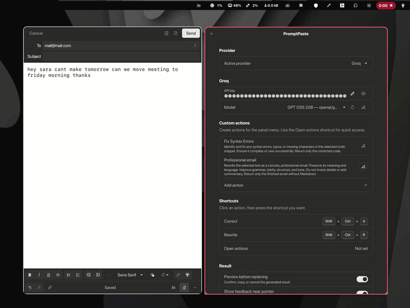

# PromptPaste

Use AI on selected text anywhere in GNOME. Correct writing, rewrite a sentence, translate, summarize, or create your own action by changing the prompts. Select the text, use your shortcut, and the result is pasted back automatically.

Supports local Ollama plus Groq, Gemini, OpenRouter, Cerebras, OpenAI, and Vercel AI Gateway. Add your own API key in the extension settings:

- Ollama: https://ollama.com
- Groq: https://console.groq.com/keys
- Gemini: https://ai.google.dev/aistudio
- OpenRouter: https://openrouter.ai/keys
- Cerebras: https://cloud.cerebras.ai
- OpenAI: https://platform.openai.com/api-keys
- Vercel AI Gateway: https://vercel.com/ai-gateway

Clipboard text is sent to your chosen provider only when you run an action.

Create your own actions, reuse `${language}`, `${tone}`, `${style}`, or `${selection}` in prompts, and optionally preview results before replacing text.

GNOME Extensions publication pending.

## What to know

Groq, Gemini, Cerebras, and selected OpenRouter models offer free access with usage limits. Free models and limits may change:

- **Groq:** Free plan with model-specific limits. Groq says inference data is not retained by default or used for training without permission.
- **Gemini:** Has a free tier. Outside the EEA, Switzerland, and UK, free-tier inputs and outputs may be used to improve Google products and may be reviewed by humans. Do not send sensitive information. This does not apply to users in those regions under the current terms.
- **OpenRouter:** Only models marked as free are free. Data handling depends on the selected model provider; enable Zero Data Retention in OpenRouter's privacy settings when available.
- **Cerebras:** Free tier with model-specific limits.
- **Ollama:** Runs locally and does not send text to an online provider when using a local Ollama server.
- **OpenAI and Vercel AI Gateway:** Usage may be charged by the provider. PromptPaste itself does not charge anything.

Your selected text is sent only when you run an action. Using previously copied clipboard text is optional and disabled by default. API keys are stored locally in GNOME settings, but they are not stored in an encrypted password vault. Do not share your keys, and revoke any key that may have been exposed.

Firefox uses explicit-copy compatibility by default because its Wayland selection can be unreliable. This mode sends Ctrl+C and changes the regular clipboard. Other application IDs can be added in Settings.

AI responses can be incorrect. Enable result preview if you want to review generated text before replacing the selection.
